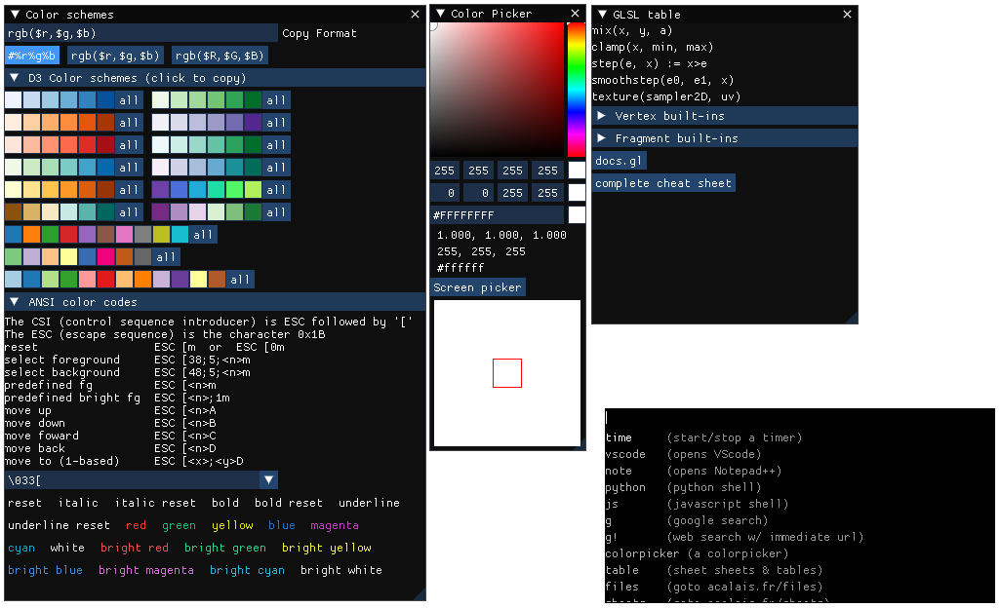

# CtrlShiftE

The universal shortcut tool!

A very handy utility, with global shortcuts (web, files...), a color picker, a list of tables (ascii, glsl cheatsheet...), and a "keylogger" that records key usage stats because I'm a nerd.
